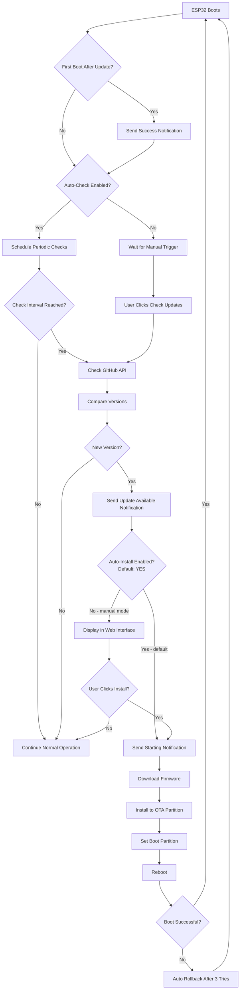

# OTA Updates — Quick Start

## Overview

BoatReporterESP supports Over-The-Air (OTA) firmware updates via GitHub Releases. Once the initial firmware is flashed over USB, all subsequent updates can be delivered remotely — no physical access to the device required.

- **Current firmware version**: `1.1.8`
- **Default repository**: `Robert336/BoatReporterESP`
- **Auto-check and auto-install**: enabled by default

> **Forks:** If you forked this repository, change the GitHub owner/repo on the OTA settings page before the device first connects to the internet. Otherwise it will attempt to pull releases from the upstream repo.

## Prerequisites

- **Hardware**: ESP32 with WiFi connectivity
- **GitHub repository**: Public or private repo for hosting firmware releases
- **PlatformIO**: Installed and configured
- **WiFi network**: ESP32 must be connected to WiFi with internet access

## Step 1: Build & Upload Initial Firmware

```bash
# Connect ESP32 via USB, then:
pio run -e prod --target upload
```

The binary is created at `.pio/build/prod/firmware.bin`.

## Step 2: Configure OTA Settings (if needed)

Defaults are pre-configured to `Robert336/BoatReporterESP` with auto-check and auto-install enabled. The device is ready to receive updates out of the box. Optionally verify:

1. Open the ESP32 web interface (connect to its IP or AP mode)
2. Open the **Settings** hub, then tap **"Firmware Updates (OTA)"**
3. Confirm GitHub repository is set to your repo
4. Confirm auto-check is enabled (default: ON, 24-hour interval)
5. Confirm auto-install is enabled (default: ON)
6. Confirm OTA notifications are enabled (default: ON)

## Step 3: Create a Release

### Update the version

Update the version string in **both** locations (they must match):

**`include/Version.h`:**
```cpp
#define FIRMWARE_VERSION "1.1.9"
```

**`platformio.ini`** (the `[env:prod]` build flag is what the production binary actually embeds):
```ini
[env:prod]
build_flags =
    -D PRODUCTION_BUILD
    -D FIRMWARE_VERSION=\"1.1.9\"
```

### Build firmware

```bash
pio run -e prod
```

### Create the GitHub Release

1. Go to: `https://github.com/your-username/your-repo/releases/new`
2. **Tag**: `v1.1.9` (must follow `vX.Y.Z` format)
3. **Title**: `Version 1.1.9`
4. **Upload**: `.pio/build/prod/firmware.bin` (must be named exactly `firmware.bin`)
5. Click **"Publish release"**

## Step 4: Update Flows

### Automatic Update Flow (default)

When auto-install is enabled, the device handles everything without user intervention:

1. Checks for updates on the configured schedule (default: every 24 hours)
2. Detects new version → sends "update available" notification
3. Downloads firmware from GitHub in the background
4. Installs to the OTA partition
5. Reboots with new firmware
6. Sends success notification

**Total time offline**: 1–2 minutes.

### Manual Update Flow

1. In the ESP32 web interface, go to the OTA page
2. Click **"Check for Updates"**
3. If an update is available, click **"Install Update"**
4. Enter the update password if one is configured
5. Device downloads, installs, and reboots

### Notification Templates

| Stage | Message |
|-------|---------|
| Update available | `BilgeRise: Firmware update available v1.1.8 → v1.1.9` |
| Installation starting | `BilgeRise: Starting firmware update from v1.1.8 to v1.1.9. Device may be offline for 1-2 minutes.` |
| Success | `BilgeRise: Firmware updated successfully! v1.1.8 → v1.1.9. System online.` |
| Failure | `BilgeRise: Firmware update FAILED - {reason}. Still running v1.1.8.` |
| Rollback | `BilgeRise: New firmware v1.1.9 failed to boot. Rolled back to v1.1.8. System stable.` |

### Update Flow Diagram



## Safety Features

### Automatic Rollback

If new firmware fails to boot 3 times consecutively, the ESP32 bootloader automatically rolls back to the previous working firmware. A rollback notification is sent.

### Signal Strength Check

Before downloading firmware, the device checks WiFi RSSI. If the signal is below **-70 dBm**, the update is aborted in a FAILED state. The "starting update" notification is **not** sent for weak-signal aborts, so you won't receive a start message followed by a failure.

The version-check API call (lightweight HTTPS GET) is not gated by RSSI — only the download commit is blocked.

### Flood Abort

Updates only proceed in the NORMAL system state. If an emergency (flood) is detected during an update, the download is aborted.

### Pre-flight Validation

Before any bytes are downloaded:
- Firmware size bounds (64 KB – 4 MB)
- Available flash space (firmware size + 5% margin)
- Available heap (≥ 2 KB)
- WiFi signal strength (≥ -70 dBm)

### Password Protection (optional)

Set an update password on the OTA settings page to require confirmation for manual installs via the web interface. Auto-install bypasses the password by design (intended for unattended operation).

## Testing Walkthrough

### Creating a Test Release

1. Bump the version in `include/Version.h` and `platformio.ini`
2. Add a small test change (e.g., a log message in `setup()`)
3. Build: `pio run -e prod`
4. Create a GitHub Release with tag `vX.Y.Z` and upload `firmware.bin`

### Verifying Manual Check

1. Open the OTA page in the web interface
2. Click **"Check for Updates"**
3. Expected: "Update Available! Version X.Y.Z is ready to install"
4. If notifications are enabled, receive: `BilgeRise: Firmware update available v1.1.8 → vX.Y.Z`

### Verifying Auto-Install

1. Ensure auto-install is enabled on the OTA settings page
2. Click **"Check for Updates"** (or wait for the scheduled check)
3. The device should automatically download, install, and reboot
4. Receive success notification after reboot

### Testing Rollback with Bad Firmware

1. Create a release with firmware that crashes immediately (e.g., `ESP.restart()` in `setup()`)
2. Install via OTA
3. Expected: device boots, crashes, reboots 3 times, then rolls back to the previous version
4. Receive rollback notification

### Testing Error Scenarios

| Scenario | How to trigger | Expected result |
|----------|---------------|-----------------|
| Invalid GitHub repo | Set repo to a non-existent `owner/repo` | Error message in web interface |
| No internet | Disconnect WiFi router from internet | "GitHub API request failed" error |
| Weak signal | Move ESP32 far from router (RSSI < -70 dBm) | Update aborted in FAILED state, no start notification |
| Wrong password | Set a password, then try manual install with wrong password | "Invalid password" error, update blocked |
| No firmware.bin | Create release without uploading the binary | "No firmware.bin found in release" error |

## Configuration Reference

| Setting | Default | Purpose |
|---------|---------|---------|
| **GitHub Repo** | `Robert336/BoatReporterESP` | Where to check for releases |
| **Auto-check** | ✅ Enabled | Automatically check for updates on schedule |
| **Auto-install** | ✅ Enabled | Automatically install updates without user action |
| **Check Interval** | 24 hours | How often to check for updates |
| **Notifications** | ✅ Enabled | SMS/Discord alerts at each stage |
| **Update Password** | (none) | Require password for manual installs via web UI |
| **GitHub Token** | (none) | Access token for private repositories |

## Troubleshooting

| Problem | Solution |
|---------|----------|
| "No updates available" when update exists | Check GitHub release tag format: `vX.Y.Z`; verify asset is named exactly `firmware.bin`; ensure release is published (not draft) |
| Download fails | Verify WiFi has internet access; check GitHub repo is public or token provided; verify free heap memory |
| Update fails | Check firmware built for correct board (`upesy_wroom`); verify partition scheme supports OTA; review serial logs for specific errors |
| Device won't boot after update | Wait ~30 seconds for automatic rollback; if rollback fails, flash via USB |
| No notifications | Check SMS/Discord credentials configured; verify OTA notifications enabled in settings; confirm WiFi connected |
| Auto-install not working | Verify auto-check is also enabled; check last-check time — may need to wait for next scheduled check; click "Check for Updates" to trigger immediately |

## Verification Checklist

- [ ] Initial firmware built and uploaded via USB
- [ ] GitHub repo configured in OTA settings
- [ ] Manual update check works
- [ ] Update notifications sent (SMS/Discord)
- [ ] Firmware download and installation successful
- [ ] Device reboots and validates new firmware
- [ ] Success notification received
- [ ] Auto-install works
- [ ] Update password protection works (if enabled)
- [ ] Weak signal check blocks install below -70 dBm
- [ ] Rollback works for bad firmware
- [ ] Rollback notification received
- [ ] Error handling works for all failure scenarios
- [ ] OTA web interface displays correct status
- [ ] Version information accurate throughout process