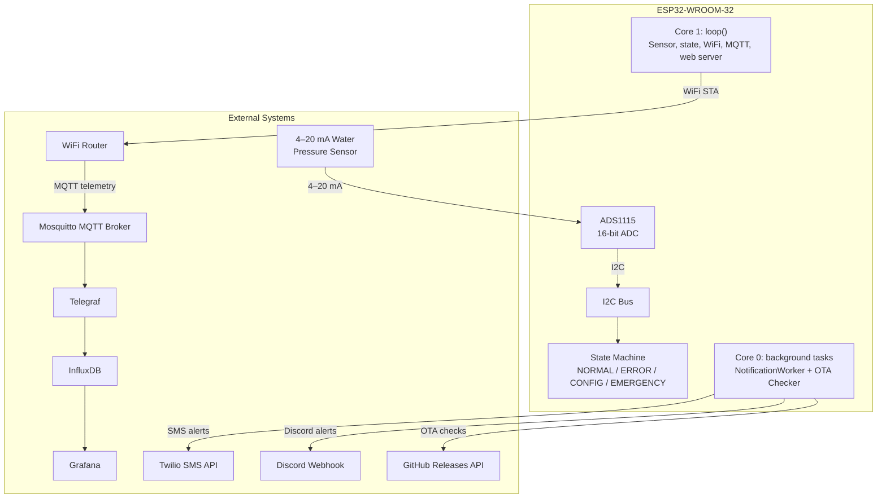
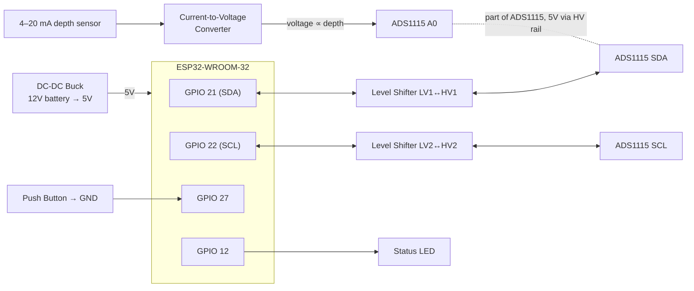

# BoatReporterESP

[](https://opensource.org/licenses/MIT)
[](https://github.com/Robert336/BoatReporterESP/releases)
[](https://platformio.org/)
[](https://www.arduino.cc/)
[](https://en.cppreference.com/)


**A complete embedded system for boat bilge monitoring** — ESP32 firmware, hardware design, and a self-hosted cloud monitoring stack. Measures water level via a 4–20 mA pressure sensor, dispatches two-tier SMS/Discord/webhook alerts during floods, and streams live telemetry to a Grafana dashboard. No cloud subscription, no companion app — all configuration is handled through a captive-portal web interface served by the device itself.

<details>
<summary><strong>Grafana dashboard</strong> — live water level, system state, and device health</summary>


</details>

<details>
<summary><strong>Web interface</strong> — dashboard, settings, notifications, WiFi, and calibration</summary>


</details>

---

## Tech Stack

| Layer | Technologies |
|-------|-------------|
| **Languages** | C++17, JavaScript, Python, Bash |
| **Firmware** | ESP32-WROOM (FreeRTOS + Arduino framework), PlatformIO, ADS1115 16-bit ADC (I2C) |
| **Hardware** | 4–20 mA pressure sensor, current-to-voltage converter, logic level shifter, DC-DC buck converter, waterproof enclosure |
| **Networking** | WiFi (STA + AP mode), MQTT (TLS, port 8883), captive-portal DNS, NTP |
| **Cloud/Infra** | Mosquitto, Telegraf, InfluxDB, Grafana, Docker Compose, Cloudflare DDNS, Let's Encrypt |
| **APIs** | Twilio REST API (SMS), Discord webhooks, GitHub Releases API (OTA) |
| **Tools** | Unity test framework (61 tests), Node.js mock server, gzip compression pipeline, NVS persistent storage |

---

## Architecture Overview



The firmware runs on a dual-core ESP32: **Core 1** handles the main loop — sensor reads, state machine, WiFi maintenance, MQTT polling, and the web server. **Core 0** runs two dedicated FreeRTOS tasks for outbound HTTP notifications and background OTA update checks. A task watchdog (10-second timeout) reboots the device automatically if the main loop stalls.

---

## Engineering Challenges

### Remote Deployment — No Access to the Target Environment

We never set foot on the boat. The entire system was designed and built from verbal requirements, a handful of photos of the bilge area, and general knowledge of typical marina environments. No direct access to the WiFi network, no ability to measure the physical constraints in person, no way to debug hardware issues on-site.

This constraint drove every major design decision. The device had to survive first boot and configuration without a technician present — hence the **captive-portal web interface** served by the device itself, with no app to install and no cloud dependency. All credentials (WiFi, Twilio, Discord, MQTT) are configured at runtime through the browser, stored in NVS, and survive firmware updates. If the WiFi network changes, the owner can reconfigure remotely by pressing the button to enter setup mode.

Since we couldn't observe the device in its environment, we built extensive **self-diagnostic capabilities**: the status LED communicates system state at a glance, the serial monitor logs every event, and all logs stream to an MQTT broker for remote inspection. The task watchdog ensures the device recovers from software hangs without human intervention. The OTA update system with automatic rollback means firmware can be fixed remotely if a bug slips through.

We also designed for **unknown WiFi conditions** — marina captive portals, weak signal, dynamic IPs. The device probes its connectivity every 2 minutes, detects when a portal is intercepting traffic, and defers alerts until the network is open. A custom MAC address override lets the owner match an already-authenticated device without physical access to the ESP32.

In short: every feature that makes this system robust — the web-based config, the self-diagnostics, the captive portal detection, the OTA pipeline, the NVS persistence — was born from the constraint that we would never be able to walk up to the device and fix it in person.

### ESP32 ADC Noise & Non-Linearity

The first prototype used the ESP32's built-in ADC. Two problems emerged immediately. First, the ESP32's ADC2 is multiplexed with the WiFi radio — enabling WiFi introduced massive noise into the readings, making water level detection unreliable. Second, the ESP32's internal ADC has inherent non-linearity across its voltage range, so even when WiFi was off, the mapping from millivolts to water depth was inconsistent.

The fix was an external **ADS1115 16-bit ADC** over I2C. This moved the analog conversion off the ESP32 entirely (no WiFi interference), gave us true 16-bit precision (vs. the ESP32's effective ~9 bits), and uses a stable external voltage reference. The noise problem was solved.

But the non-linearity persisted. The ADS1115 is linear — the problem was upstream. We built a data collection rig: dunked the pressure probe into a graduated cylinder and recorded millivolts, actual water depth, calculated depth, and current draw at 5 cm intervals across the full 0–100 cm range. Plotting the data revealed that the **current-to-voltage converter module** was introducing non-linearity at low voltages (below ~800 mV), compressing the response curve near the zero point.

We solved this by biasing the C-V converter's operating point: cranked the offset potentiometer to its maximum (~560 mV at 0 cm water level) and adjusted the span to cover as much of the 0–3.3 V range as possible. This pushed the readings out of the module's non-linear region and into its linear operating range. The trade-off is that we lose the top ~30 cm of the sensor's 1 m range — the voltage clips at about 70 cm. For a bilge application where thresholds are typically set at 5–20 cm, this is well within the usable range.

The result: a stable, repeatable water level reading across the 5–70 cm band, with less than ±0.5 cm error after two-point software calibration.

### I2C Bus Recovery & Stuck-Line Detection

The ADS1115 ADC communicates over I2C at 100 kHz. On a boat, voltage dips from bilge pump startup can corrupt the bus, leaving the ADC in a hung state. The firmware implements automatic bus recovery with up to 10 retry cycles, including a bus reset sequence. If the line remains stuck (180 consecutive byte-identical samples ≈ 3 minutes), the reading is invalidated and a one-shot owner notification is sent — the device degrades gracefully rather than reporting a false stable reading.

### Latest-Wins Emergency Notification Queue

Notifications are sent over HTTP (Twilio, Discord, webhook), which can block for up to 10 seconds per call. The NotificationWorker runs on a dedicated FreeRTOS task with a **depth-1 overwrite queue** for emergency alerts. During a WiFi outage, repeated emergency messages coalesce — when connectivity returns, the owner receives only the most recent water level snapshot, not a backlog of stale readings. A separate 8-slot FIFO handles one-shot events (silence confirmations, sensor recovery) with strict priority: the emergency mailbox is always drained first.

### Flood-Abort OTA Updates

Firmware downloads take up to 5 minutes over WiFi. If water reaches the emergency threshold mid-download, the download is aborted immediately. This ensures the bilge sensor is never blinded for the full download window. A callback checks water level inside the download loop, and auto-install is suppressed entirely while the device is in EMERGENCY state. The OTA system also performs a signal-strength pre-flight check (refuses download below −70 dBm RSSI) and supports automatic rollback if the new firmware fails to boot three times consecutively.

### Captive Portal Detection & Alert Gating

Marina and guest WiFi networks commonly intercept HTTP with a sign-in page. The device probes a connectivity-check endpoint after associating (and every 2 minutes while connected). A hijacked response (redirect or served page) marks the link as `PORTAL` and captures the sign-in URL. While a portal is detected, outbound notification sends **fail fast** instead of burning their 10-second timeout against the hijacked connection. Alerts resume automatically once the probe reports the network open. A custom MAC address override lets the owner present an already-authenticated MAC to the network.

### NTP + TLS Bootstrap

The ESP32's real-time clock starts at Unix epoch 0 (January 1, 1970) on every cold boot. TLS certificate validation against the MQTT broker's Let's Encrypt cert fails immediately — the cert is "not yet valid" from the device's perspective. The firmware handles this with exponential backoff retry: MQTT connections are silently dropped for the first 1–3 minutes after boot until NTP syncs the clock. Telemetry is buffered locally and published once the connection establishes. The broker certificate is validated against bundled ISRG Root X1/X2 CA roots compiled into the firmware.

### Two-Tier State Machine with Safety-First Transitions

The system operates in four states (NORMAL, ERROR, CONFIG, EMERGENCY) with carefully designed transition rules. CONFIG mode is an overlay — a flood condition forces an exit to EMERGENCY even while the web portal is active, so an open browser tab cannot suppress flood detection. A sensor fault mid-flood degrades to ERROR after 60 seconds instead of latching in EMERGENCY on stale data. The 5-second debounce window on both entry and exit prevents false alarms from transient wave slosh or condensation. The GPIO 12 status LED is intentionally forced off during EMERGENCY to avoid visual distraction.

---

## Key Features

- **Real-time Water Level Monitoring** — 4–20 mA pressure sensor → current-to-voltage converter → ADS1115 16-bit ADC (I2C, 100 kHz). 10-sample median filter rejects impulse noise. 1 Hz gate allows cheap reads from the main loop. Usable range 5–100 cm.
- **Two-Tier Emergency Alerts** — Tier 1 (configurable, default 30 cm) triggers SMS (Twilio), Discord, and custom HTTP webhook notifications. Tier 2 (default 50 cm) additionally pulses a dedicated alert output. Configurable repeat interval (default 15 minutes). Silent toggle via 5-second button hold.
- **Self-Hosted Grafana Dashboard** — Docker Compose stack (Mosquitto → Telegraf → InfluxDB → Grafana) with 12 panels: live water level, rate-of-change trend, system-state timeline, RSSI history, chip temperature, uptime, firmware version, heap usage. WAN/TLS deployment with Cloudflare DDNS and Let's Encrypt certificates.
- **Captive-Portal Web Configuration** — Multi-page mobile-first UI served as gzip-compressed HTML through the device's own WiFi access point. No app to install, no cloud dependency. 39 REST API endpoints for full device configuration.
- **OTA Firmware Updates** — Automatic background checks against GitHub Releases (24-hour interval). Auto-install with flood abort, RSSI pre-flight check, and automatic rollback on boot failure. Download is aborted mid-flight if water reaches the emergency threshold.
- **MQTT Telemetry + Home Assistant** — 13-field structured JSON payload published every 60 s (retained). Full log streaming to a configurable broker. TLS support with Let's Encrypt certificate validation. Home Assistant auto-discovery ready.
- **Sensor Hardening** — I2C auto-recovery with bus reset, stuck-line detection (180 consecutive identical samples), over-range rejection (readings above 110 cm treated as electrical faults), and sustained-failure owner notifications.
- **Two-Point Calibration** — Linear interpolation between zero and a second reference point. Calibration persisted to NVS, surviving firmware updates and power cycles.

---

## Testing

The firmware includes **61 unit tests** covering the state machine and sensor logic, running on the host machine (no hardware required):

```bash
pio test -e native
```

- **Sensor Logic (17 tests)**: single-point and two-point calibration, voltage-to-centimeters conversion, median filtering, invalid reading detection, edge cases (negative voltages, division by zero, extrapolation).
- **State Machine (44 tests)**: all state transitions (NORMAL → EMERGENCY → ERROR → CONFIG), condition timing and hysteresis, notification timing and silence toggle, horn control and pulsing patterns.

The test suite uses extracted pure-function headers (`include/StateMachine.h`) with mock Arduino and ADS1115 stubs, enabling rapid regression testing without physical hardware. A mock sensor build environment (`env:mock`) allows full firmware testing with simulated sensor data.

---

<details>
<summary><strong>Quick Start</strong> — build, flash, and configure</summary>

1. **Clone** this repository.
2. **No compile-time secrets are required.** All credentials are configured at runtime through the web UI and stored in NVS.
3. **Build & upload** to your ESP32:
   ```bash
   pio run -e prod --target upload    # production build
   pio run -e dev  --target upload    # development build (all logs)
   pio run -e mock --target upload    # no hardware needed
   ```
4. **Configure in the browser**: on first boot, connect to the `ESP32-BilgeRise-Setup` WiFi access point (password printed to serial at 115200 baud), browse to `http://192.168.4.1`, and enter your WiFi and alert credentials.

> **Build pipeline note:** `scripts/compress_html.py` automatically gzips the web UI into `src/compressed_pages.h` on every build — no manual HTML embedding required.

Full setup, calibration, and MQTT walkthroughs: **[docs/configuration.md](docs/configuration.md)**.

</details>

<details>
<summary><strong>Hardware & Wiring</strong> — components, diagram, and assembly</summary>

**Core components:** ESP32-WROOM · ADS1115 16-bit ADC · 4–20 mA depth sensor (0–100 cm) · current-to-voltage converter · DC-DC buck converter (12 V → 5 V) · 4-channel logic level shifter · waterproof enclosure with 7-pin connector · push button · status LED.

Full parts list with links and assembly steps: **[docs/hardware.md](docs/hardware.md)**

### Wiring Diagram



**Signal summary**

| ESP32 | Connection | Notes |
|-------|-----------|-------|
| GPIO 21 / 22 | I2C SDA / SCL | via logic level shifter LV↔HV to ADS1115 SDA/SCL |
| 3.3V / 5V | Level shifter LV / HV rails | ADS1115 VDD is 5V (HV side) |
| GPIO 27 | Push button → GND | internal pull-up; enters CONFIG mode |
| GPIO 12 | Status LED | NORMAL/ERROR/CONFIG only, never EMERGENCY |
| ADS1115 A0 | C-V converter output | from the 4–20 mA depth sensor |

</details>

---

## Documentation

📖 Full documentation site available at: **[BoatReporterESP Docs](https://robert336.github.io/BoatReporterESP/)** (or browse directly in the [`docs/`](docs/README.md) folder).

| Guide | What's inside |
|-------|---------------|
| [Configuration](docs/configuration.md) | First-time setup, WiFi, Twilio/Discord/custom-HTTP credentials, calibration, thresholds, MQTT broker |
| [Usage](docs/usage.md) | LED patterns, system states, button functions, alert behavior |
| [MQTT & Telemetry](docs/mqtt-telemetry.md) | Topics, JSON payload schema, Home Assistant / Grafana ingestion |
| [Troubleshooting](docs/troubleshooting.md) | WiFi, sensor, alert, LED, and web-interface fixes |
| [Hardware & Assembly](docs/hardware.md) | Full parts list, wiring, step-by-step assembly |
| [Architecture](docs/architecture.md) | Component layout, FreeRTOS task design, state machine, data flow |
| [API Reference](docs/api-reference.md) | 39 REST endpoints with request/response schemas and curl examples |
| [OTA Updates](OTA_QUICKSTART.md) | Release creation, auto-install, rollback, verification checklist |
| [Server Stack](server-stack/README.md) | Docker Compose setup, Grafana dashboard, WAN/TLS deployment |
| [User Guide](USER_GUIDE.md) | End-user operation: LED meanings, button functions, troubleshooting |

---

## Project Structure

```
src/                  Firmware source (Arduino + FreeRTOS)
include/              Headers and GPIO map
docs/                 User-facing documentation
dev-ui/               Standalone mock server for web UI development
server-stack/         Docker Compose + Grafana dashboard provisioning
test/                 Native unit tests (61 tests, Unity framework)
scripts/              Build scripts (HTML compression, certificate management)
```

---

## License & Authors

Built by **Robert Mazza and David Miller** to solve a real problem: monitoring the water level in a friend's bilge.

Licensed under the [MIT License](LICENSE). Built with [PlatformIO](https://platformio.org/), the Arduino framework, [Adafruit ADS1X15](https://github.com/adafruit/Adafruit_ADS1X15), [ArduinoJson](https://arduinojson.org/), and [PubSubClient](https://github.com/knolleary/pubsubclient).

For issues, questions, or suggestions, please [open an issue](https://github.com/Robert336/BoatReporterESP/issues) on GitHub.