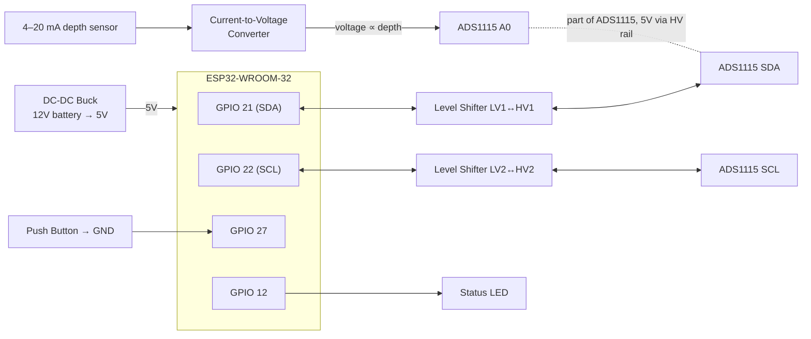

# BoatReporterESP

**An ESP32-based bilge monitoring system (firmware v1.1.8).** It continuously measures water level in your boat's bilge, dispatches emergency alerts the moment the level crosses a danger threshold, and streams live telemetry to a self-hosted Grafana dashboard — so you can check on your vessel from anywhere.


**At a glance:** water-level monitoring (5–100 cm) · two-tier SMS/Discord/webhook emergency alerts · captive-portal web config (no app to install) · remote OTA firmware updates · live Grafana monitoring dashboard.


## Contents

- [Why](#why)
- [Features](#features)
- [Quick Start](#quick-start)
- [Hardware & Wiring](#hardware--wiring)
- [Documentation](#documentation)
- [Development](#development)
- [Safety](#safety)
- [Contributing](#contributing)
- [License & Authors](#license--authors)

## Why

Bilge pumps fail. Float switches stick. And you are not always at the dock to notice. BoatReporterESP is a low-cost ESP32 module installed in the bilge that monitors water level continuously and alerts you before conditions become critical — via SMS, Discord, or any HTTP webhook — while a live dashboard lets you review trends from anywhere. There is no cloud subscription and no companion app to install: all configuration is handled through a mobile-friendly web interface served by the device itself.

## Features

- **Real-time Water Level Monitoring** — 4–20 mA pressure sensor sampled through an ADS1115 16-bit ADC (I2C, 100 kHz, address 0x48); usable range 5–100 cm
- **Two-Tier Emergency Alerts** — Tier 1 (default 30 cm) triggers SMS, Discord, and custom-HTTP notifications; Tier 2 (default 50 cm) provides a higher threshold for the most critical conditions
- **Live Monitoring Dashboard** — self-hosted Grafana stack (Mosquitto → Telegraf → InfluxDB → Grafana) shows live level, rate-of-change, system-state timeline, connectivity, and device health. See [`server-stack/README.md`](server-stack/README.md)
- **No-App Web Config** — multi-page UI (dashboard, WiFi, notifications, settings, calibration, OTA) served as gzip-compressed HTML through a captive portal; optimized for mobile browsers
- **Remote OTA Updates** — firmware updates pulled from GitHub Releases, with automatic update checking and installation enabled by default and automatic rollback on failure
- **MQTT Telemetry + Home Assistant** — structured JSON every 60 s plus full log streaming to a configurable broker
- **Two-Point Calibration** — accurate sensor calibration for your specific setup
- **Sensor Hardening** — I2C auto-recovery, stuck and over-range detection, and sustained-failure owner notifications

<details>
<summary><strong>For developers</strong> — firmware-internal details</summary>

- **Notification Worker** — SMS, Discord, and webhook HTTP calls run on a dedicated FreeRTOS task (Core 0); a latest-wins coalescing policy prevents stale-message backlogs after WiFi outages
- **System State Machine** — NORMAL, ERROR, EMERGENCY, and CONFIG states; the GPIO 12 status LED reflects NORMAL/ERROR/CONFIG (including a WiFi-disconnected double-blink)
- **Task Watchdog** — automatic reboot if the main loop stalls (10-second timeout)
- **NTP Time Synchronization** — accurate timestamping of events
- **Persistent Storage** — WiFi credentials, calibration values, and all notification settings persisted to NVS
- **Mock Sensor Mode** — full firmware with simulated sensor data via the `env:mock` build environment (no hardware required)
- **No Compile-Time Secrets** — Twilio, Discord, custom-HTTP, and MQTT credentials are entered through the web UI and stored in NVS

</details>

## Quick Start

1. **Clone** this repository.
2. **No compile-time secrets are required.** All credentials (Twilio, Discord, custom-HTTP, MQTT) are configured at runtime through the web UI and stored in NVS. `include/secrets.h.example` is a placeholder template — copy it to `include/secrets.h` only if you need compile-time overrides (none are required for normal operation).
3. **Build & upload** to your ESP32:
   ```bash
   # Production build (use this on the boat)
   pio run -e prod --target upload

   # Development build (all logs)
   pio run -e dev --target upload

   # Mock sensor build (no hardware needed)
   pio run -e mock --target upload
   ```
4. **Configure in the browser** — on first boot the device opens a captive portal. Connect to the `ESP32-BilgeRise-Setup` WiFi access point (the password is unique per device and printed to the serial monitor at 115200 baud), browse to `http://192.168.4.1`, and enter your WiFi and alert credentials.

> **Build pipeline note:** `scripts/compress_html.py` automatically gzips the web UI from `dev-ui/` and `src/html/` into `src/compressed_pages.h` on every build, so no manual HTML embedding is required.

Full setup, calibration, and MQTT walkthroughs are in [docs/configuration.md](docs/configuration.md).

## Hardware & Wiring


**Core components:** ESP32-WROOM · ADS1115 16-bit ADC · 4–20 mA depth sensor (0–100 cm) · current-to-voltage converter · DC-DC buck converter (12 V → 5 V) · 4-channel logic level shifter · waterproof enclosure with 7-pin connector · push button · status LED.

Full parts list with links and assembly steps: **[docs/hardware.md](docs/hardware.md)**

### Wiring Diagram



> **Level shifter rails:** ESP32 3.3V → LV, 5V → HV; GND is common to all modules. ADS1115 VDD is 5V (HV side). The C-V converter output feeds ADS1115 A0.

**Signal summary**

| ESP32 | Connection | Notes |
|-------|-----------|-------|
| GPIO 21 / 22 | I2C SDA / SCL | via logic level shifter LV↔HV to ADS1115 SDA/SCL |
| 3.3V / 5V | Level shifter LV / HV rails | ADS1115 VDD is 5V (HV side) |
| GPIO 27 | Push button → GND | internal pull-up; enters CONFIG mode |
| GPIO 12 | Status LED | NORMAL/ERROR/CONFIG only, never EMERGENCY |
| ADS1115 A0 | C-V converter output | from the 4–20 mA depth sensor |

> 📸 **Photo placeholder:** add a photo of the assembled unit and wiring here once available.

## Documentation

The sections above cover the essentials. For everything else, see the [`docs/`](docs/README.md) hub:

- **[Configuration](docs/configuration.md)** — first-time setup, WiFi, Twilio/Discord/custom-HTTP credentials, two-point calibration, emergency thresholds, MQTT broker
- **[Usage](docs/usage.md)** — LED patterns, system states, button functions, alert behavior
- **[MQTT & Telemetry](docs/mqtt-telemetry.md)** — log and structured telemetry topics, the JSON payload, Home Assistant / Grafana ingestion
- **[Troubleshooting](docs/troubleshooting.md)** — WiFi, sensor, alert, LED, and web-interface fixes
- **[Hardware & Assembly](docs/hardware.md)** — full parts list, wiring, and step-by-step assembly
- **[Monitoring stack](server-stack/README.md)** — self-hosted Grafana (Mosquitto → Telegraf → InfluxDB → Grafana), including WAN/TLS deployment
- **[OTA updates](OTA_QUICKSTART.md)** — remote firmware update walkthrough
- **[Architecture](docs/architecture.md)** — component layout, FreeRTOS tasks, data flow
- **[API Reference](docs/api-reference.md)** — ConfigServer REST endpoints
- **[Web UI development](dev-ui/README.md)** — mock server for developing the config pages without flashing

## Development

```bash
# Production build (use this on the boat)
pio run -e prod --target upload

# Development build (all logs)
pio run -e dev --target upload

# Mock sensor build (no hardware needed)
pio run -e mock --target upload
```

Managed dependencies: `adafruit/Adafruit ADS1X15`, `bblanchon/ArduinoJson`, `knolleary/PubSubClient`.

For architecture, component layout, and FreeRTOS task design, see **[docs/architecture.md](docs/architecture.md)**. For the config-server API, see **[docs/api-reference.md](docs/api-reference.md)**. Web UI changes are developed in [`dev-ui/`](dev-ui/README.md) against a Node.js mock server; `scripts/compress_html.py` auto-gzips pages into `src/compressed_pages.h` on build. Run the unit tests with `pio run -e native -t test`.

## Safety

### ⚠️ Important Safety Notice

**This device is a monitoring aid and should not be relied upon as the sole means of vessel safety.**

- Always maintain proper bilge pumps with independent float switches
- Regular physical inspection of your vessel is essential
- This system is a supplementary alert mechanism
- Test the system regularly
- Ensure reliable power supply (consider battery backup)
- Follow all marine safety regulations and manufacturer guidelines

## Contributing

Contributions are welcome! See [`CONTRIBUTING.md`](CONTRIBUTING.md) for the build setup, web-UI mock server, tests, and pull-request process. This project follows the [Contributor Covenant](CODE_OF_CONDUCT.md) code of conduct. Notable changes per release are recorded in [`CHANGELOG.md`](CHANGELOG.md).

## License & Authors

Project by **Robert Mazza and David Miller**, licensed under the [MIT License](LICENSE).

- Built with [PlatformIO](https://platformio.org/) and the Arduino framework
- Uses the [Adafruit ADS1X15 Library](https://github.com/adafruit/Adafruit_ADS1X15)
- ESP32 WiFi and NVS libraries from Espressif
- Originally built to solve a practical problem: monitoring the water level in a friend's bilge.

For issues, questions, or suggestions, please [open an issue](https://github.com/Robert336/BoatReporterESP/issues) on the GitHub repository.
