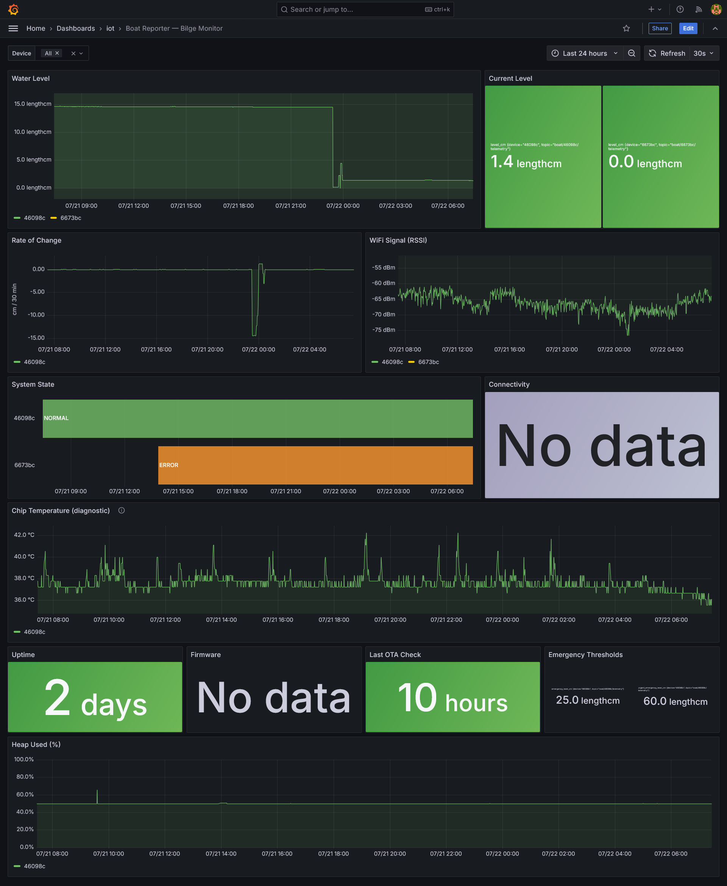
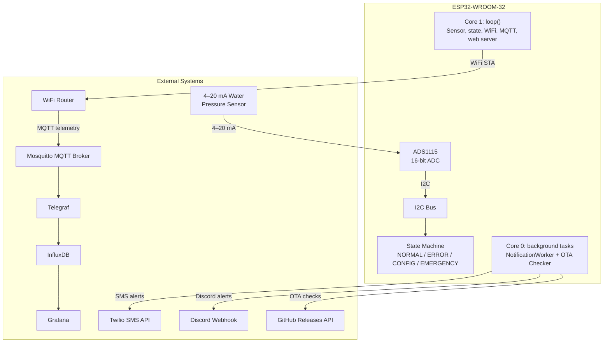

# BoatReporterESP

[](https://opensource.org/licenses/MIT)
[](https://github.com/Robert336/BoatReporterESP/releases)
[](https://platformio.org/)
[](https://www.arduino.cc/)
[](https://en.cppreference.com/)


**A complete embedded system for boat bilge monitoring** — ESP32 firmware, hardware design, and a self-hosted monitoring stack. Measures water level via a 4–20 mA pressure sensor, dispatches two-tier SMS/Discord/webhook alerts during floods, and streams live telemetry to a Grafana dashboard. Configuration is local (captive-portal UI on the device — no companion app). Alerts and telemetry still depend on the external services you enable (Twilio, Discord/webhooks, your MQTT broker, etc.); see [Architecture — On-device vs external hosts](docs/architecture.md#on-device-vs-external-hosts).

<details>
<summary><strong>Grafana dashboard</strong> — live water level, system state, and device health</summary>



</details>

<details>
<summary><strong>Web interface</strong> — dashboard, settings, notifications, WiFi, and calibration</summary>


</details>

---

## Tech Stack

| Layer | Technologies |
|-------|-------------|
| **Languages** | C++17, JavaScript, Python, Bash |
| **Firmware** | ESP32-WROOM (FreeRTOS + Arduino framework), PlatformIO, ADS1115 16-bit ADC (I2C) |
| **Hardware** | 4–20 mA pressure sensor, current-to-voltage converter, logic level shifter, DC-DC buck converter, waterproof enclosure |
| **Networking** | WiFi (STA + AP mode), MQTT (TLS, port 8883), captive-portal DNS, NTP |
| **Cloud/Infra** | Mosquitto, Telegraf, InfluxDB, Grafana, Docker Compose, Cloudflare DDNS, Let's Encrypt |
| **APIs** | Twilio REST API (SMS), Discord webhooks, GitHub Releases API (OTA) |
| **Tools** | Unity test framework (61 tests), Node.js mock server, gzip compression pipeline, NVS persistent storage |

---

## Architecture Overview



The firmware runs on a dual-core ESP32: **Core 1** handles the main loop — sensor reads, state machine, WiFi maintenance, MQTT polling, and the web server. **Core 0** runs two dedicated FreeRTOS tasks for outbound HTTP notifications and background OTA update checks. A task watchdog (10-second timeout) reboots the device automatically if the main loop stalls.

Full component layout, FreeRTOS task design, and data flow: **[docs/architecture.md](docs/architecture.md)**.

---

## Design Decisions

How we designed for a device we never visited on-site. Short outcomes below; full write-ups live in **[Architecture → Design Decisions](docs/architecture.md#design-decisions)**.

| Challenge | Outcome |
|-----------|---------|
| [Remote deployment](docs/architecture.md#remote-deployment) — no physical access to the boat | Captive-portal web UI, NVS credentials, self-diagnostics, OTA with rollback |
| [ESP32 ADC noise & non-linearity](docs/architecture.md#esp32-adc-noise-and-non-linearity) | External ADS1115 + C-V bias; ±0.5 cm after two-point calibration |
| [I2C bus recovery](docs/architecture.md#i2c-bus-recovery-and-stuck-line-detection) | Auto retry/reset; stuck-line invalidation + owner notification |
| [Latest-wins notification queue](docs/architecture.md#latest-wins-emergency-notification-queue) | Depth-1 overwrite mailbox so outages deliver the freshest reading, not a backlog |
| [Flood-abort OTA](docs/architecture.md#flood-abort-ota-updates) | Mid-download abort on flood; RSSI pre-flight; boot-loop rollback |
| [Captive portal detection](docs/architecture.md#captive-portal-detection-and-alert-gating) | Probe every 2 min; fail-fast alerts while gated; custom MAC override |
| [NTP + TLS bootstrap](docs/architecture.md#ntp-and-tls-bootstrap) | Backoff until clock sync; bundled ISRG roots for Let's Encrypt |
| [Safety-first state machine](docs/architecture.md#two-tier-state-machine-with-safety-first-transitions) | CONFIG overlay cannot suppress flood; sensor-fault fail-safe mid-emergency |

---

## Key Features

- **Real-time Water Level Monitoring** — 4–20 mA pressure sensor → current-to-voltage converter → ADS1115 16-bit ADC (I2C, 100 kHz). 10-sample median filter rejects impulse noise. 1 Hz gate allows cheap reads from the main loop. Usable range 5–100 cm.
- **Two-Tier Emergency Alerts** — Tier 1 (configurable, default 30 cm) triggers SMS (Twilio), Discord, and custom HTTP webhook notifications. Tier 2 (default 50 cm) additionally pulses a dedicated alert output. Configurable repeat interval (default 15 minutes). Silent toggle via 5-second button hold.
- **Self-Hosted Grafana Dashboard** — Docker Compose stack (Mosquitto → Telegraf → InfluxDB → Grafana) with 12 panels: live water level, rate-of-change trend, system-state timeline, RSSI history, chip temperature, uptime, firmware version, heap usage. WAN/TLS deployment with Cloudflare DDNS and Let's Encrypt certificates.
- **Captive-Portal Web Configuration** — Multi-page mobile-first UI served as gzip-compressed HTML through the device's own WiFi access point. No companion app; credentials are stored in NVS. (Outbound alerts/telemetry still need the services you configure — [details](docs/architecture.md#on-device-vs-external-hosts).) 39 REST API endpoints for full device configuration.
- **OTA Firmware Updates** — Automatic background checks against GitHub Releases (24-hour interval). Auto-install with flood abort, RSSI pre-flight check, and automatic rollback on boot failure. Download is aborted mid-flight if water reaches the emergency threshold.
- **MQTT Telemetry + Home Assistant** — 13-field structured JSON payload published every 60 s (retained). Full log streaming to a configurable broker. TLS support with Let's Encrypt certificate validation. Home Assistant auto-discovery ready.
- **Sensor Hardening** — I2C auto-recovery with bus reset, stuck-line detection (180 consecutive identical samples), over-range rejection (readings above 110 cm treated as electrical faults), and sustained-failure owner notifications.
- **Two-Point Calibration** — Linear interpolation between zero and a second reference point. Calibration persisted to NVS, surviving firmware updates and power cycles.

---

## Testing

### Unit tests

The firmware includes **61 unit tests** covering the state machine and sensor logic, running on the host machine (no hardware required):

```bash
pio test -e native
```

- **Sensor Logic (17 tests)**: single-point and two-point calibration, voltage-to-centimeters conversion, median filtering, invalid reading detection, edge cases (negative voltages, division by zero, extrapolation).
- **State Machine (44 tests)**: all state transitions (NORMAL → EMERGENCY → ERROR → CONFIG), condition timing and hysteresis, notification timing and silence toggle, horn control and pulsing patterns.

The test suite uses extracted pure-function headers (`include/StateMachine.h`) with mock Arduino and ADS1115 stubs. A mock sensor build (`env:mock`) allows full firmware testing with simulated sensor data. How to run and extend: **[test/TESTING_README.md](test/TESTING_README.md)**.

### Validation campaigns

Beyond unit tests, we ran long-duration soak and hardware campaigns and wrote up the log analysis:

| Campaign | Duration | Headline result | Write-up |
|----------|----------|-----------------|----------|
| Mock soak (sine-wave sensor) | ~24 h | Heap −416 B (0.17%); no leak; stable state machine | [soak-test summary](test-logs/soak-test-20260321-summary.md) |
| Cylinder drip test (real 4–20 mA sensor + MQTT) | ~3.5 h | Clean fill/drain tracking to 64 cm; heap stable; plots included | [drip-test analysis](test-logs/drip-test-20260502-analysis.md) |
| Random-state soak | ~62 h | 53 paired transitions; min heap 113.9 KB; 4 WiFi reconnects | [random-state analysis](test-logs/random-state-test-20260523-analysis.md) |

Catalog of logs, plots, and the MQTT parser: **[test-logs/README.md](test-logs/README.md)**.

---

## Quick Start

1. **Clone** this repository.
2. **Build & upload** to your ESP32:
   ```bash
   pio run -e prod --target upload    # production build
   pio run -e dev  --target upload    # development build (all logs)
   pio run -e mock --target upload    # no hardware needed
   ```
3. **Configure in the browser**: on first boot, connect to the `ESP32-BilgeRise-Setup` WiFi access point (password printed to serial at 115200 baud), browse to `http://192.168.4.1`, and enter your WiFi and alert credentials.

> **Build pipeline note:** `scripts/compress_html.py` automatically gzips the web UI into `src/compressed_pages.h` on every build — no manual HTML embedding required.

Full setup, calibration, and MQTT walkthroughs: **[docs/configuration.md](docs/configuration.md)**.  
Parts list, wiring diagram, GPIO map, and assembly: **[docs/hardware.md](docs/hardware.md)**.

---

## Documentation

Full documentation site: **[BoatReporterESP Docs](https://robert336.github.io/BoatReporterESP/)** (or browse [`docs/`](docs/README.md)).

| Guide | Audience | What's inside |
|-------|----------|---------------|
| [Architecture](docs/architecture.md) | Engineers / recruiters | Design Decisions, FreeRTOS layout, state machine, data flow |
| [Configuration](docs/configuration.md) | Installers | First-time setup, WiFi/portal, credentials, calibration, thresholds, MQTT |
| [User Guide](USER_GUIDE.md) | Boat owners / installers | Day-to-day LED meanings, button, silencing, owner handout page |
| [Usage](docs/usage.md) | Engineers | Technical LED/state/button/alert reference |
| [Troubleshooting](docs/troubleshooting.md) | Installers | Symptom → signal → fix triage |
| [Hardware & Assembly](docs/hardware.md) | Installers | Parts list, wiring diagram, GPIO map, assembly |
| [MQTT & Telemetry](docs/mqtt-telemetry.md) | Engineers | Topics, JSON payload, Home Assistant / Grafana |
| [API Reference](docs/api-reference.md) | Engineers | 39 REST endpoints with schemas and curl examples |
| [OTA Updates](OTA_QUICKSTART.md) | Contributors | Release creation, auto-install, rollback |
| [Server Stack](server-stack/README.md) | Operators | Docker Compose + Grafana; see also [DEPLOYMENT.md](server-stack/DEPLOYMENT.md) |
| [Security](SECURITY.md) | Everyone | Secrets posture, config AP, broker exposure, reporting |
| [Validation campaigns](test-logs/README.md) | Engineers / recruiters | Soak and hardware log analyses |

---

## Project Structure

```
src/                  Firmware source (Arduino + FreeRTOS)
include/              Headers and GPIO map (BoardPins.h)
docs/                 Guides (config, architecture, hardware, API, …)
dev-ui/               Standalone mock server for web UI development
server-stack/         Docker Compose + Grafana dashboard provisioning
test/                 Native unit tests (61 tests, Unity framework)
test-logs/            Soak / hardware validation analyses and plots
scripts/              Build scripts (HTML compression, certificate management)
```

---

## License & Authors

Built by **Robert Mazza and David Miller** to solve a real problem: monitoring the water level in a friend's bilge.

Licensed under the [MIT License](LICENSE). Built with [PlatformIO](https://platformio.org/), the Arduino framework, [Adafruit ADS1X15](https://github.com/adafruit/Adafruit_ADS1X15), [ArduinoJson](https://arduinojson.org/), and [PubSubClient](https://github.com/knolleary/pubsubclient).

For issues, questions, or suggestions, please [open an issue](https://github.com/Robert336/BoatReporterESP/issues) on GitHub. For security-sensitive reports, see [SECURITY.md](SECURITY.md).
