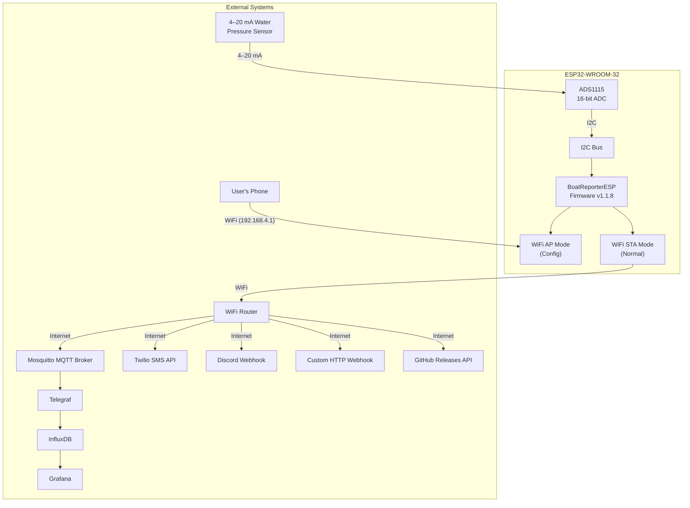
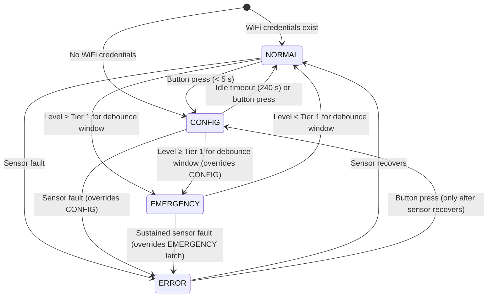
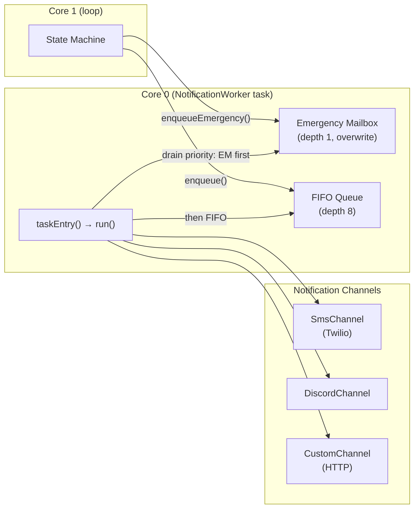
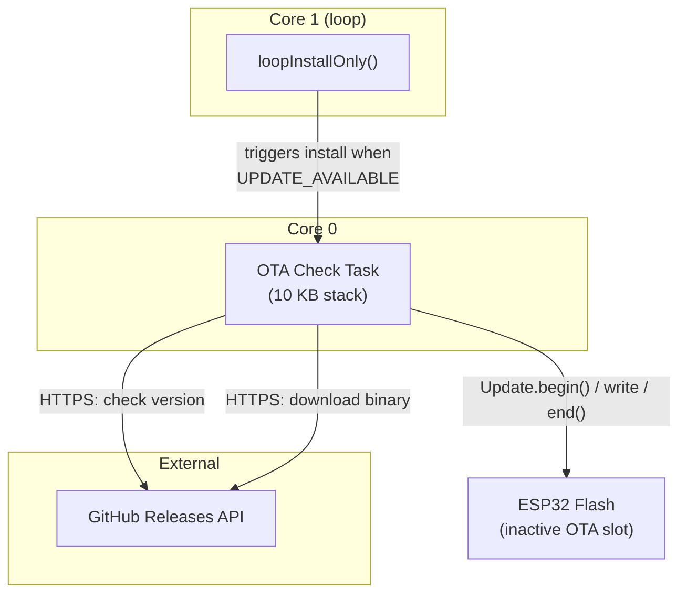
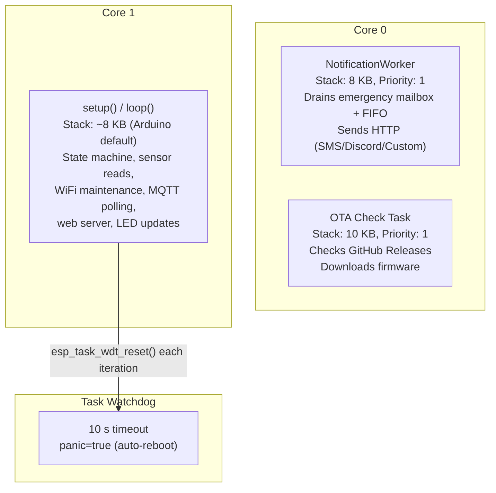

# Architecture

## Table of Contents

- [Overview](#overview)
- [System Context Diagram](#system-context-diagram)
- [Core Components](#core-components)
  - [1. State Machine](#1-state-machine-maincpp--statemachineh)
  - [2. Sensor Subsystem](#2-sensor-subsystem-waterpressuresensor)
  - [3. Notification System](#3-notification-system-notificationworker--channels)
  - [4. Web Configuration Server](#4-web-configuration-server-configserver)
  - [5. OTA Update System](#5-ota-update-system-otamanager)
  - [6. MQTT Service](#6-mqtt-service-mqttservice)
  - [7. Settings Store](#7-settings-store-settingsstore)
  - [8. WiFi Manager](#8-wifi-manager-wifimanager)
  - [9. LED / Light Control](#9-led--light-control-lightcode)
- [FreeRTOS Task Layout](#freertos-task-layout)
- [Data Flow](#data-flow)
- [Build Environments](#build-environments)
- [Partition Layout](#partition-layout)

## Overview

BoatReporterESP is an ESP32-based bilge-water monitoring system that continuously measures water level via a 4–20 mA pressure sensor, detects flood conditions through a two-tier state machine, and dispatches alerts over SMS (Twilio), Discord webhooks, and a custom HTTP endpoint. It publishes structured telemetry to an MQTT broker for time-series dashboards (Grafana/InfluxDB) and supports over-the-air firmware updates from GitHub Releases. A captive-portal web interface on the device's own Wi-Fi access point handles all configuration; no companion app is required.

The firmware is organized around a single-threaded `loop()` on Core 1 that runs the state machine, sensor reads, MQTT polling, and web server, while Core 0 hosts two dedicated FreeRTOS tasks: one for outbound HTTP notifications and one for background OTA version checks. All persistent configuration lives in NVS (non-volatile storage) and is accessed through a fast in-RAM cache (`SettingsStore`).

Current firmware version: **1.1.8**.

## System Context Diagram



## Core Components

### 1. State Machine (`main.cpp` + `StateMachine.h`)

The state machine is the central decision engine. It evaluates sensor readings against configurable thresholds and drives all outputs: alert GPIO, LED pattern, notification dispatch, and horn pulsing.

#### States

| State | Meaning |
|-------|---------|
| `NORMAL` | Water level below Tier 1 threshold. Sensor healthy. |
| `CONFIG` | Web configuration portal active. Safety transitions to ERROR/EMERGENCY still honored. |
| `ERROR` | Sensor fault detected (invalid readings). Flood detection is offline. |
| `EMERGENCY` | Water level exceeds Tier 1 threshold for the debounce window. Notifications fire; horn pulses at Tier 2. |

#### State Transition Diagram



#### Key Behaviors

- **Two-tier emergency**: Tier 1 (`emergencyWaterLevel_cm`) triggers SMS/Discord/HTTP notifications at a configurable frequency. Tier 2 (`urgentEmergencyWaterLevel_cm`) additionally pulses the horn/alert output (GPIO 26) with configurable on/off durations.
- **Debounce**: Both entering and leaving EMERGENCY require the condition to persist for `EMERGENCY_TIMEOUT_MS` (default 5 s), preventing false alarms from transient splashes.
- **Safety-first transitions**: CONFIG is an overlay; sensor errors and flood conditions always force an exit to ERROR or EMERGENCY, even while the web portal is active.
- **Silence toggle**: A 5-second button hold during EMERGENCY silences notifications and the horn. A second 5-second hold re-enables them. Silence auto-clears on return to NORMAL.
- **Sensor fault in EMERGENCY**: A sustained sensor fault during a flood degrades to ERROR rather than latching in EMERGENCY indefinitely on stale data.

The main entry point is `updateStateMachine()` (`StateMachine.h`, line 424), which is a pure function called once per `loop()` iteration. It returns a `StateMachineOutput` struct of side-effect flags; `loop()` reads these flags and executes the corresponding actions (GPIO writes, notification enqueues, LED pattern changes).

### 2. Sensor Subsystem (`WaterPressureSensor`)

The `WaterPressureSensor` class (`include/WaterPressureSensor.h`) wraps an ADS1115 16-bit ADC over I2C and provides filtered, calibrated water-level readings.

#### Signal Chain

```
4–20 mA sensor → shunt resistor → ADS1115 ADC → I2C (SDA=21, SCL=22) → ESP32
```

#### Features

- **Median filter**: A 10-sample circular buffer; `readLevel()` returns the rolling median, rejecting impulse noise.
- **1 Hz sample gate**: `readLevel()` is internally gated to one ADC read per second. Calls from the tight `loop()` are cheap; they return the cached result between samples.
- **Rate-of-change tracking**: 7 snapshots at 5-minute intervals (30-minute window). `getRateOfChange_cm30min()` returns the cm change extrapolated from oldest to newest snapshot, or NaN if fewer than 2 valid snapshots exist. Included in emergency alert messages.
- **Stuck/flatline detection**: 180 consecutive byte-identical raw ADC samples (~3 minutes at 1 Hz) indicate a frozen line or dead transducer. The reading is invalidated.
- **I2C bus recovery**: On I2C read failure, `recoverBus()` attempts up to `BUS_RECOVERY_MAX_ATTEMPTS` (10) retries with bus reset. If all fail, `isBusUnrecoverable()` returns true and a one-shot notification is sent.
- **2-point calibration**: `setCalibrationPoint(0, mV, 0)` sets the zero-level voltage; `setCalibrationPoint(1, mV, cm)` sets a second reference point. `voltageToCentimeters()` performs linear interpolation between them. Calibration is persisted to NVS by `ConfigServer`.
- **Overrange rejection**: Readings above `WATER_LEVEL_RANGE_MAX_CM + READING_OVERRANGE_MARGIN_CM` (110 cm) are treated as electrical faults.

### 3. Notification System (`NotificationWorker` + channels)

Outbound HTTP notifications run on a dedicated FreeRTOS task to avoid blocking the main loop during provider timeouts (up to 10 seconds per send).

#### Architecture



#### Key Design Decisions

- **Latest-wins emergency mailbox** (`emergencyMailbox`): Depth-1 queue written with `xQueueOverwrite`. During a WiFi outage, repeated emergency alerts coalesce; when connectivity returns, the owner receives only the most recent snapshot, not a flood of stale messages.
- **16-slot FIFO ring buffer** (`fifoQueue`): For one-shot events (silence confirmations, sensor recovery, bus errors). Each message is distinct and must be delivered.
- **Strict priority**: The task always drains the emergency mailbox before the FIFO. Wake-up is via direct task notification (`xTaskNotifyGive`), not a queue set, guaranteeing ordering.
- **Per-channel retry**: Failed critical alerts are retried up to 4 times with exponential backoff (5 s → 15 s → 30 s).
- **Channel coalescing**: All channels for a message are packed into one `NotifMsg` struct (bitmask of `CHAN_*` flags), preventing partial delivery (e.g. SMS sent but Discord dropped).

#### Notification Channels

| Channel | Class | Transport |
|---------|-------|-----------|
| SMS | `SmsChannel` | Twilio REST API (HTTPS) |
| Discord | `DiscordChannel` | Discord webhook (HTTPS) |
| Custom | `CustomChannel` | Configurable HTTP endpoint (method, URL, headers, body template) |

### 4. Web Configuration Server (`ConfigServer`)

`ConfigServer` (`include/ConfigServer.h`) provides a captive-portal web interface for all device configuration. It runs only in the `CONFIG` state.

#### Features

- **Access Point**: SSID `ESP32-BilgeRise-Setup` with a unique password derived from the ESP32 chip ID. IP: `192.168.4.1`.
- **Captive portal**: DNS server on port 53 redirects all DNS queries to the device, triggering the phone's captive-portal detection.
- **Captive-portal detection (warning only)**: `portalState` from `WiFiManager` is surfaced in `/status` and `/init`; when a portal is detected the Wi-Fi page shows a warning advising the owner to set an authenticated/whitelisted MAC. The device does not attempt to complete the portal sign-in itself.
- **Gzip-compressed pages**: HTML pages are pre-compressed at build time (`scripts/compress_html.py`) and served with `Content-Encoding: gzip`.
- **25+ REST API endpoints**: WiFi network management, sensor calibration, notification settings (SMS, Discord, Custom), MQTT broker config, OTA settings, and debug monitoring.
- **Auto-timeout**: `SERVER_TIMEOUT_MS` (240 s) of inactivity triggers an automatic return to NORMAL via the state machine.
- **Safety override**: The state machine forces CONFIG → ERROR or CONFIG → EMERGENCY regardless of server activity, so an open browser tab cannot suppress flood detection.

#### Key Endpoints

| Endpoint | Method | Purpose |
|----------|--------|---------|
| `/` | GET | Main dashboard |
| `/wifi` | GET | WiFi configuration page |
| `/notifications` | GET | Notification settings page |
| `/settings` | GET | Settings hub |
| `/debug` | GET | Debug/monitoring page |
| `/ota` | GET | OTA update page |
| `/init` | GET | Merged JSON for main page load |
| `/calibrate/zero` | POST | Set zero calibration point |
| `/calibrate/point2` | POST | Set second calibration point |
| `/emergency/level` | POST | Set Tier 1 threshold |
| `/emergency/urgent` | POST | Set Tier 2 threshold |
| `/emergency/notif-freq` | POST | Set notification frequency |
| `/sms/phone` | POST | Set SMS phone number |
| `/sms/twilio` | POST | Set Twilio credentials |
| `/discord/webhook` | POST | Set Discord webhook URL |
| `/custom/config` | POST | Set custom HTTP channel |
| `/mqtt/config` | POST | Configure MQTT broker |
| `/ota/check` | GET | Manual update check |
| `/ota/update` | POST | Start firmware update |
| `/ota/settings` | POST | Configure OTA behavior |

### 5. OTA Update System (`OTAManager`)

`OTAManager` (`include/OTAManager.h`) handles over-the-air firmware updates from GitHub Releases.

#### Architecture



#### Features

- **Background check task**: Runs on Core 0 with a 10 KB stack (for mbedTLS handshakes). Checks GitHub Releases API on a configurable schedule (default 24 h, minimum 12 h).
- **Auto-install**: When enabled, the `loop()` task hands off the install to the check task once a new version is found. The device reboots on success.
- **Flood abort (C2)**: A callback (`otaFloodCheckCallback`) is invoked inside the download loop. If the water level reaches Tier 1 during a download, the download is aborted so the bilge sensor is never blinded for the full download window (up to 5 minutes).
- **Signal strength pre-flight check**: Download is refused if RSSI < `OTA_MIN_RSSI_DBM` (−70 dBm).
- **Rollback detection**: On first boot after an OTA update, `checkFirstBoot()` sets a flag. If the device reboots without clearing it (boot loop), the next boot detects the rollback and notifies the owner.
- **Version comparison**: Semantic version parsing (`parseVersionComponent`) compares major.minor.patch components.
- **Thread safety**: `currentState` is `std::atomic`; `lastError` and `versionInfo` are protected by a FreeRTOS mutex (`stateMux`).

### 6. MQTT Service (`MQTTService`)

`MQTTService` (`include/MQTTService.h`) provides a persistent MQTT client for telemetry and logging.

#### Topics

| Topic | Direction | Retained | Purpose |
|-------|-----------|----------|---------|
| `<baseTopic>/telemetry` | Publish | Yes | Structured JSON: water level, rate, state, RSSI, chip temp, uptime, heap |
| `<baseTopic>/log` | Publish | No | Log messages from `LOG_*` macros |
| `<baseTopic>/availability` | Publish (LWT) | Yes | `"online"` on connect, `"offline"` on disconnect (Last Will and Testament) |

`<baseTopic>` defaults to `boat/<6-hex-MAC>`.

#### Features

- **Non-blocking log queue**: A 16-slot ring buffer (`LOG_QUEUE_SIZE`) decouples `LOG_*` macros from the wire. `publishLog()` enqueues; `loop()` drains. Thread-safe across cores via `portMUX_TYPE` spinlock.
- **Exponential backoff reconnect**: 5 s → 10 s → 20 s → 30 s cap.
- **TLS support**: Optional TLS (port 8883) with Let's Encrypt certificate validation via bundled CA roots. Plaintext (port 1883) when disabled.
- **Subscriber fan-out**: `PubSubClient` supports only one global callback; `MQTTService` maintains a `std::vector<Subscription>` and fans out incoming messages to registered callbacks.
- **Reentrancy guard**: `inMqttCall` flag prevents internal reconnect log messages from recursing into `publish()`.

### 7. Settings Store (`SettingsStore`)

`SettingsStore` (`include/SettingsStore.h`) provides NVS-backed persistent storage for alarm thresholds and notification timing, with a fast in-RAM cache.

#### Design

- **Single source of truth**: `SettingsValues` (typedef for `AlarmSettings`) is shared between the state machine, `ConfigServer`, and `SettingsStore`. `ConfigServer` writes; the state machine reads via the in-RAM copy.
- **No NVS I/O on the hot path**: `SettingsStore::get()` returns a const reference to the in-RAM struct. `load()` is called once at boot and after any config save.
- **NVS namespace**: `"emergency"`; separate from WiFi, OTA, and calibration namespaces.

#### Stored Values

| Field | Default | Range |
|-------|---------|-------|
| `emergencyWaterLevel_cm` | 30.0 | 5.0 – 100.0 |
| `urgentEmergencyWaterLevel_cm` | 50.0 | 5.0 – 100.0 |
| `emergencyNotifFreq_ms` | 900000 (15 min) | 5000 – 3600000 |
| `hornOnDuration_ms` | 1000 | 100 – 10000 |
| `hornOffDuration_ms` | 4000 | 100 – 10000 |

### 8. WiFi Manager (`WiFiManager`)

`WiFiManager` (`include/WiFiManager.h`) manages WiFi station-mode connectivity with multi-network support.

#### Features

- **Multi-network storage**: Up to 10 SSID/password pairs stored in NVS (`"wifi"` namespace). Fixed-size `char[]` storage; no heap fragmentation. Open (passwordless) networks are supported for marina guest Wi‑Fi.
- **Auto-connect to best available**: `connectToBestNetwork()` scans and picks the strongest known network.
- **Rescan fallback (H1/H2)**: After 6 consecutive failed `WiFi.reconnect()` attempts (3 minutes), falls back to a full scan-and-pick cycle. Sticky disconnect reasons (4-way handshake timeout, beacon timeout, auth failure) escalate after only 2 attempts.
- **Captive portal detection**: After association (and every 2 minutes while connected), the device probes a connectivity-check endpoint. A hijacked response (redirect or served page instead of `204`) marks the link `PORTAL` and captures the portal's sign-in URL; probe failures keep the previous state rather than flapping on a weak signal. Per-network results are persisted in NVS (`portal_N` flags) so the Wi-Fi page can pre-warn on reconnect to a known-portal network. Detection is warning-only — the device does not attempt to complete the sign-in.
- **Portal-aware outbound gating**: `HttpPoster` (used by all notification channels) fails fast while the link is `PORTAL` instead of burning its 10 s timeout against the portal's hijack. Messages are retried on the normal schedule once the probe reports the network open.
- **Custom STA MAC override**: A MAC address override (persisted in NVS, applied via `esp_wifi_set_mac` before each association) lets the owner present a different address to access points — useful for matching an already-authenticated/whitelisted MAC on a captive-portal network.
- **AP+STA mode during CONFIG**: The device runs both station and access point simultaneously during configuration.
- **Connection health tracking**: Session durations logged using `esp_timer_get_time()` (microseconds, monotonic) to survive `millis()` rollover (~49.7 days).

### 9. LED / Light Control (`LightCode`)

`LightCode` (`include/LightCode.h`) drives the status LED on GPIO 12 with non-blocking pattern updates.

#### Patterns

| Pattern | Enum | Meaning |
|---------|------|---------|
| Off | `PATTERN_OFF` | NORMAL state, WiFi connected |
| Double blink | `PATTERN_DOUBLE_BLINK` | NORMAL state, WiFi disconnected |
| Slow blink | `PATTERN_SLOW_BLINK` | CONFIG state |
| Fast blink | `PATTERN_FAST_BLINK` | ERROR state |
| Off (forced) | `PATTERN_OFF` | EMERGENCY state; intentionally dark to avoid visual distraction during a flood |

The LED is explicitly forced off in EMERGENCY to prevent a leftover pattern (e.g., WiFi-disconnected double blink) from running through the emergency.

## FreeRTOS Task Layout



- **Core 0**: Dedicated to blocking I/O: HTTP requests for notifications and OTA downloads. Both tasks run at priority 1.
- **Core 1**: The Arduino `setup()`/`loop()` task. Handles all real-time sensor reading, state evaluation, and GPIO control. Registered with the task watchdog (10 s timeout).
- **Watchdog**: `esp_task_wdt_init(10, true)`; if `loop()` stalls for more than 10 seconds, the ESP32 reboots automatically.

## Data Flow

### Normal Operation

```
[Water Pressure Sensor] → [ADS1115 ADC] → [WaterPressureSensor::readLevel()]
    → [median filter + calibration] → [StateMachineSensorReading]
    → [updateStateMachine()] → [LED pattern, MQTT telemetry (every 60 s)]
```

### Emergency Alert Flow

```
[WaterPressureSensor::readLevel()] → [level_cm ≥ emergencyWaterLevel_cm]
    → [updateEmergencyConditions() sets emergencyConditions = true]
    → [EMERGENCY_TIMEOUT_MS debounce] → [computeNextState() → EMERGENCY]
    → [shouldSendEmergencyNotification()] → [NotificationWorker::enqueueEmergency()]
    → [Core 0 task sends SMS/Discord/HTTP]
    → [if Tier 2: shouldHornBeOn() pulses ALERT_PIN (GPIO 26)]
```

### Configuration Flow

```
[Phone connects to ESP32 AP] → [Captive portal DNS redirect]
    → [192.168.4.1 web interface] → [ConfigServer REST endpoints]
    → [SettingsStore::save() → NVS] or [channel-specific NVS writes]
```

### MQTT Telemetry Flow

```
[loop() every 60 s] → [build JSON: level_cm, rate, state, RSSI, chip_temp, heap, uptime]
    → [MQTTService::publishTelemetry()] → [Mosquitto broker]
    → [Telegraf] → [InfluxDB] → [Grafana dashboard]
```

## Build Environments

Defined in `platformio.ini`:

| Environment | Platform | Purpose | Key Flags |
|-------------|----------|---------|-----------|
| `dev` | espressif32 | Development, all logging enabled | *(none)* |
| `prod` | espressif32 | Production, critical logs only | `-D PRODUCTION_BUILD`, `-D FIRMWARE_VERSION="1.1.8"` |
| `mock` | espressif32 | Soak testing with simulated sensor data (no hardware) | `-D ENABLE_MOCK_MODE` |
| `native` | native | Host-side unit tests | `-D UNIT_TESTING`, `-std=c++11` |
| `esp32-test` | espressif32 | On-device tests with mock sensor | `-D UNIT_TESTING`, `-D ENABLE_MOCK_MODE` |

All ESP32 environments share:
- **Platform**: `espressif32@6.13.0`
- **Board**: `upesy_wroom`
- **Framework**: Arduino
- **Partitions**: `partitions.csv` (OTA-capable)
- **Libraries**: Adafruit ADS1X15, ArduinoJson v6, PubSubClient
- **Build flags**: `MQTT_MAX_PACKET_SIZE=512`, `MQTT_KEEPALIVE=60`, `MQTT_SOCKET_TIMEOUT=5`
- **Pre-build script**: `scripts/compress_html.py` (gzip-compresses web pages)

## Partition Layout

From `partitions.csv`: 4 MB flash, OTA-capable:

| Name | Type | SubType | Offset | Size | Notes |
|------|------|---------|--------|------|-------|
| `nvs` | data | nvs | 0x9000 | 0x5000 (20 KB) | Non-volatile storage, preserved across OTA updates |
| `otadata` | data | ota | 0xe000 | 0x2000 (8 KB) | OTA boot partition selector |
| `app0` | app | ota_0 | 0x10000 | 0x1e0000 (1.9 MB) | Primary firmware slot |
| `app1` | app | ota_1 | 0x1f0000 | 0x1e0000 (1.9 MB) | Secondary firmware slot |
| `spiffs` | data | spiffs | 0x3e0000 | 0x20000 (128 KB) | SPIFFS filesystem (web page assets) |

The dual 1.9 MB app slots enable safe OTA: the new firmware is written to the inactive slot, and the bootloader atomically switches on next boot. NVS and SPIFFS are preserved across updates, so configuration and calibration survive firmware upgrades.
