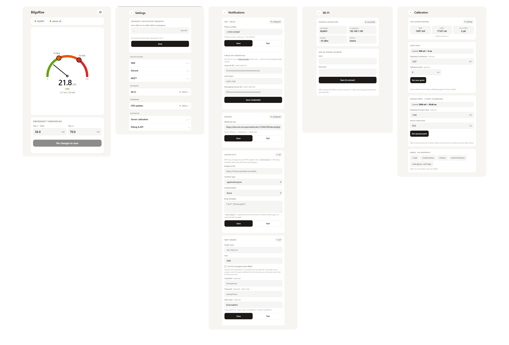

# Configuration

All configuration happens in the browser: connect to the device's setup access point and the captive portal opens automatically. The UI is mobile-first, so it works well from a phone on the dock.

Parts, wiring, and GPIO map: [Hardware & Assembly](hardware.md). Owner day-to-day ops: [User Guide](../USER_GUIDE.md). Secrets posture: [SECURITY.md](../SECURITY.md).

## First Time Setup

On first boot (or when no WiFi credentials are saved), the device automatically enters CONFIG mode:

1. The built-in LED will **slow blink** indicating CONFIG mode
2. Connect to the WiFi access point: `ESP32-BilgeRise-Setup`
   - The AP password is **unique per device**, derived from the chip ID. It is printed to the serial monitor on boot (115200 baud) at startup inside a labelled banner.
3. Open a web browser and navigate to `http://192.168.4.1` or any `http://...` domain (`https://...` will not work since the site does not use SSL); the captive portal should automatically open `http://192.168.4.1`.
4. The configuration web interface appears.

If you are concerned about the lack of SSL, note that this device is not connected to the internet during configuration. The only way to man-in-the-middle the connection would be to be physically present while you connect to the config server on your boat.

## WiFi Configuration

In the web interface:
1. Enter your WiFi SSID (network name)
2. Enter your WiFi password
3. Click "Save WiFi Settings"
4. The device will restart and connect to your network

### Captive portals (marina / guest WiFi)

Many marinas and guest networks require a browser sign-in after connecting.
The device detects this automatically: after associating (and every 2 minutes
while connected) it probes a connectivity-check endpoint and shows an amber
**"portal blocked"** banner on the Wi-Fi page when HTTP is being intercepted.

The device **cannot** complete the sign-in for you — captive portals vary too
widely to handle reliably. When the banner appears, get the device online by
either:

- **Set a custom MAC address** (see the "Custom MAC address" card on the Wi-Fi
  page) to an address that is already authenticated on the marina network, or
- **Ask the network administrator to whitelist** the device's current MAC
  (shown at the top of that same card).

Notes:
- If the network is open (no WPA password), tick **"Open network (no password)"**
  when saving it.
- The device re-probes every 2 minutes, so once the MAC is authenticated or
  whitelisted the banner clears and alerts/telemetry resume automatically.
- While a portal is confirmed, outbound notification sends are deferred (they
  would only time out against the hijacked connection) and resume on their own
  once the probe reports the network open.

## Getting API Credentials

### Twilio SMS Setup

1. Create a free account at [Twilio](https://www.twilio.com/)
2. Get your Account SID and Auth Token from the Twilio Console
3. Get a Twilio phone number (or a Messaging Service SID)
4. Enter the Account SID, Auth Token, and Messaging Service SID in the web interface (**Settings → Notifications → SMS · Twilio**). These are write-only fields saved to NVS; no recompile is required.
5. Enter the recipient phone number (with country code) on the same page and select **Test**.

A Twilio trial account should be more than sufficient.

### Discord Webhook Setup

1. In Discord, go to Server Settings → Integrations → Webhooks
2. Click "New Webhook"
3. Choose the channel for notifications
4. Copy the Webhook URL
5. Enter the URL in the web interface (**Settings → Notifications → Discord**) and select **Test**.

### Custom HTTP Webhook (optional)

For any other service (Telegram, Pushover, a home-automation endpoint, etc.), use the **Custom HTTP** channel on the Notifications page. Provide an endpoint URL, a content-type, optional auth (none / Basic / Bearer token), and a body template. Place `{{message}}` where the alert text should appear; it is substituted (and JSON-escaped when the content-type is JSON) at send time.

## Sensor Calibration

#### Calibrating the Current-to-Voltage (C-V) Converter Module Using a Tube of Water

Before performing any software calibration, adjust the potentiometers (pots) on your current-to-voltage module to ensure correct electrical conversion of the sensor output. The procedure below uses a tube of water and your sensor:

1. **Set Up the Hardware:**
   - Mount your water level (or pressure) sensor securely at the bottom of a transparent tube. Make sure no water leaks around the sensor.
   - Connect the sensor to your C-V converter module, following the module's wiring instructions.
   - Connect the output of the C-V module to your multimeter's voltage input (or to your ESP32's analog input for live readings).

2. **Power the System:**
   - Power up the ESP32, the C-V module, and the sensor. Ensure all grounds are connected.

3. **Set the Zero Point (Adjust Offset Potentiometer):**
   - With the tube completely dry or the water level at 0 cm (atmospheric pressure only on the sensor), check the output voltage from the C-V converter.
   - Use a small screwdriver to adjust the 'offset' or 'zero' potentiometer on the C-V module until the output voltage reads as close to 0 V as possible (or your desired baseline voltage; some sensors output a small bias at zero).

4. **Set the Span (Adjust Gain Potentiometer):**
   - Fill the tube to your desired maximum calibration level (for example, 50 cm of water above the sensor).
   - Wait for the output voltage to stabilize.
   - Adjust the 'gain' or 'span' potentiometer on the module until the voltage matches the expected value for the sensor's output range.
   - We set our zero to output 600 mV and adjusted span to output 2190 mV at 50 cm (our test tube did not reach 1 meter).

5. **Check Linearity:**
   - Lower and raise the water level (e.g., to 25 cm and then back to 0 cm), and confirm the C-V module responds linearly.
   - Make small adjustments to offset and gain as needed, repeating steps 3 and 4, until readings are consistent across the whole range.

6. **Lock Down Calibration:**
   - Once calibration is complete, consider marking the potentiometer positions or adding a drop of nail polish to prevent movement.
   - You are now ready to proceed to software calibration via the ESP32 interface.

**Tip:** Many C-V modules have two potentiometers, one marked "Zero" (offset) and one marked "Span" (gain). If yours has labels, follow the manufacturer's documentation for each.

**Summary Table for Reference:**

| Step   | Condition         | Pot Adjusted | Target          |
|--------|-------------------|--------------|-----------------|
| 1      | 0 cm water (dry)  | Offset/Zero  | ~0 V (or baseline) |
| 2      | MAX water depth   | Gain/Span    | Expected Vmax   |

The module will now output a voltage directly proportional to the water level, ready for the final software calibration.

#### Software Calibration
If you calibrated earlier with a multimeter, you will notice that the software consistently reads off by less than 50 mV (this is acceptable).

**Two-point calibration is required for accurate readings:**

1. Press the button (GPIO 27) to enter CONFIG mode
2. Access the web interface at `http://192.168.4.1` (check serial monitor for IP)
3. Go to the "Debug & Calibration" page
4. **Zero Point Calibration:**
   - Place sensor at 0 cm water level (dry or at your baseline)
   - Note the millivolt reading displayed
   - Enter this value and select "Set Zero Point"
5. **Second Point Calibration:**
   - Submerge sensor to a known depth (e.g., 30 cm or 50 cm)
   - Note the millivolt reading
   - Enter the millivolt reading and the actual depth in cm
   - Select "Set Second Point"
6. Calibration is automatically saved to NVS

## Emergency Threshold Configuration

The system uses two independently configurable thresholds, both set via the web interface:

**Tier 1: Message Notifications (default: 30 cm)**
- When water exceeds this level for more than 5 seconds continuously, EMERGENCY state triggers.
- Sends SMS and Discord alerts at the configured notification frequency (default: 15 minutes).

**Tier 2: Urgent Alert (default: 50 cm)**
- A higher threshold for the most critical situations; both tiers activate simultaneously if water is above the Tier 2 threshold.

> **Note:** The **EMERGENCY** mode is designed as a critical alert: when the threshold is reached, the device sends emergency notifications.
> **Set the emergency threshold high enough to indicate actual danger only.**
> Setting it too low (too close to the normal bilge water level, or below minor expected splashes or condensation) may cause false alarms, unnecessary panic, and alarm fatigue.
>
> **Best practice:** Set the threshold above the typical bilge water level, but below the point where water could damage equipment or overflow.
>
> Regularly test your setup and adjust the threshold as needed to balance prompt alerts against avoiding nuisance triggers.

## MQTT Broker Configuration

The device streams all log output to an MQTT broker (useful for Home Assistant integration or remote monitoring). The broker is fully configurable from the web interface and persisted to NVS; no recompile is required.

In the web interface, open **Notification Settings → MQTT broker** and set:

| Field | Notes |
|-------|-------|
| **Broker host** | Hostname or IP of your MQTT broker (e.g. `192.168.2.41`). Use a **domain name** when TLS is enabled |
| **Port** | Defaults to `8883` (TLS enabled by default) |
| **Use TLS encryption** | Encrypts the connection and validates the broker certificate. **Required when the broker is exposed over the internet** |
| **Username** | Optional: leave blank for anonymous brokers |
| **Password** | Optional, write-only. **Leave blank to keep the current password**; saving an unrelated change will not wipe it |
| **Base topic** | Optional: defaults to `boat/<6-hex-MAC>` |

Click **Save** to apply (takes effect live, no reboot) and **Test** to publish a test message. The connection status pill polls every few seconds and shows `connected` / `disconnected` / `off`.

**TLS / WAN access:** For a broker on the local LAN, plaintext (1883) is fine. To reach a broker over the internet, enable **Use TLS encryption** and connect on **8883**; this both encrypts traffic and prevents the broker credentials from crossing the network in the clear. When TLS is on, the device validates the broker's certificate against the bundled Let's Encrypt CA roots (ISRG Root X1/X2, in `include/MqttRootCA.h`), so:
- The broker must present a valid certificate (e.g. issued by Let's Encrypt) for the hostname you connect to.
- Set **Broker host** to that **domain name**, not a bare IP; the hostname is verified against the certificate (SNI/CN).
- If your broker uses a certificate from a different CA, replace the bundle in `include/MqttRootCA.h` and reflash.

See [`server-stack/README.md`](../server-stack/README.md) for a full broker + dashboard setup, including the WAN/TLS deployment guide.

**Default broker:** out of the box (before anything is saved) the device connects to `mqtt.bilgerise.garageforge.ca:8883` with TLS encryption enabled. This default lives in `DEFAULT_MQTT_HOST` / `DEFAULT_MQTT_PORT` / `DEFAULT_MQTT_TLS` in `src/MQTTService.cpp`; change them there if you want different fallbacks baked into the firmware.

**Topics published:**
- `<base topic>/availability`: `online` / `offline` (retained LWT, for Home Assistant availability)
- `<base topic>/log`: all serial log output
- `<base topic>/telemetry`: structured JSON with water level, rate of change, state, RSSI, heap, and uptime

> **Note:** Saved broker settings survive reboots and firmware flashes (NVS is preserved). Because of that, bumping `DEFAULT_MQTT_HOST` in firmware only affects devices that have *never* had a broker saved; already-configured devices keep their saved value until you change it in the UI.
