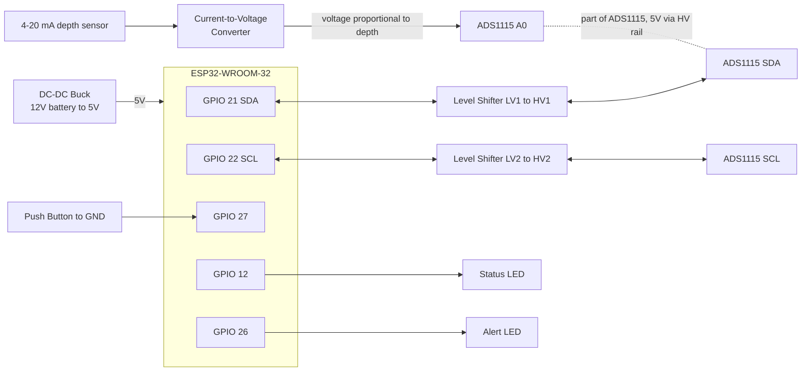

# Hardware & Assembly

This guide is the single source of truth for parts, wiring, GPIO map, and assembly of a BoatReporterESP unit. For first-time firmware configuration, see [Configuration](configuration.md). LED meanings: [Usage](usage.md).

## Parts List

| Component | Purpose |
|-----------|---------|
| [ESP32 Development Board](https://www.amazon.ca/IoTCrazy-ESP32-WROOM-32U-Dual-Core-Development-Type-C/dp/B0FP6DQJQ1/) | UPESY WROOM (or compatible ESP32 board). A model with an attachable WiFi antenna extends range; the boat's slip may be far from the marina's WiFi access point. |
| [ADS1115 16-bit ADC Module](https://www.amazon.ca/Converter-Programmable-Amplifier-Precision-Development/dp/B0F1D3KGG2/) | Precise analog-to-digital conversion with minimal signal noise. The ESP32's onboard ADC is too noisy for this application. |
| [4–20 mA Water Depth Sensor (0–100 cm)](https://www.amazon.ca/Submersible-Pressure-Sensors-Transmitter-Detector/dp/B0C44QLSZ1/) | Measures water depth via the pressure difference between atmosphere and the probe's position. |
| [Current-to-Voltage Converter](https://www.amazon.ca/Current-Converter-Conversion-Transmitter-Adjustable/dp/B099FJ4GFZ/) | Converts the sensor's 4–20 mA output to an analog voltage readable by the ADS1115. |
| [DC-DC Buck Converter (LM2596)](https://www.amazon.ca/BULVACK-LM2596-Converter-Module-1-25V-30V/dp/B07VVXF7YX/) | Steps down 12 VDC (boat battery) to 5 VDC for powering the ESP32. |
| [4-Channel Logic Level Converter](https://www.amazon.ca/CANADUINO%C2%AE-Converter-4-Channel-3-3V-5V-Bi-Directional/dp/B07GD6GN83) | 3.3V ↔ 5V bi-directional level shifter bridging the ESP32's I2C lines and the 5V-powered ADS1115. Only two channels are needed (SDA and SCL). |
| [Waterproof Project Enclosure](https://www.amazon.ca/Joinfworld-Electrical-Weatherproof-Waterproof-Electronics/dp/B0CHHJ49QN/) | Houses the ESP32, ADS1115, buck converter, and supporting components. Essential for marine environments. |
| [7-Pin Waterproof Connector](https://www.amazon.ca/Connector-Waterproof-Electrical-Connectors-Industrial/dp/B09PNJYF2T/) | Runs external wiring (power in, sensor, button) through the enclosure wall while keeping it sealed. |
| Push Button | Normally open, pull-up configured in software. Enters configuration mode / silences alerts. |
| Status LED | On GPIO 12 (`LIGHT_PIN`). Shows NORMAL / ERROR / CONFIG patterns; forced off in EMERGENCY. |
| Alert LED | On GPIO 26 (`ALERT_PIN`). Solid for Tier 1 flood, pulsing for Tier 2; off otherwise. |

## GPIO / pin map

Canonical definitions live in [`include/BoardPins.h`](../include/BoardPins.h). Do not invent pin numbers elsewhere.

| Signal | GPIO | Direction | Notes |
|--------|------|-----------|-------|
| Status LED | 12 | Output | `LIGHT_PIN` — NORMAL/ERROR/CONFIG patterns only; forced off in EMERGENCY |
| Alert LED | 26 | Output | `ALERT_PIN` — Tier 1 solid / Tier 2 pulse during EMERGENCY; off when silenced or on sensor-fault fail-safe |
| Push button | 27 | Input (pull-up) | `BUTTON_PIN` — short press → CONFIG; 5 s hold in EMERGENCY → silence toggle |
| I2C SDA | 21 | Bidirectional | To ADS1115 via level shifter LV↔HV |
| I2C SCL | 22 | Bidirectional | To ADS1115 via level shifter LV↔HV |

Pins deliberately unused (flash, strapping, UART0, input-only): see the comment block in `BoardPins.h`.

## Wiring diagram

### Signal summary

| ESP32 | Connection | Notes |
|-------|-----------|-------|
| GPIO 21 / 22 | I2C SDA / SCL | via logic level shifter LV↔HV to ADS1115 SDA/SCL |
| 3.3V / 5V | Level shifter LV / HV rails | ADS1115 VDD is 5V (HV side) |
| GPIO 27 | Push button → GND | internal pull-up; enters CONFIG mode |
| GPIO 12 | Status LED | NORMAL/ERROR/CONFIG only; off in EMERGENCY |
| GPIO 26 | Alert LED | Tier 1 solid / Tier 2 pulse in EMERGENCY |
| ADS1115 A0 | C-V converter output | from the 4–20 mA depth sensor |

### Level shifter rails

- ESP32 3.3V → LV side
- 5V → HV side
- GND is common to all modules
- ADS1115 VDD is 5V (HV side)
- The C-V converter output feeds ADS1115 A0

## Assembly

Photos of a finished unit (if available) belong in [`docs/screenshots/`](screenshots/README.md). Add them there and link from this section when you have them.

### Power path

1. Mount the DC-DC buck converter in the enclosure.
2. Route 12 V boat power through the waterproof connector to the buck input.
3. Set the buck output to 5 V and connect it to the ESP32 5V pin (and the HV rail of the level shifter / ADS1115 supply).
4. Confirm common ground across ESP32, level shifter, ADS1115, and C-V converter.

### Sensor path

1. Mount the pressure probe for the bilge (or test cylinder) and run its cable through the waterproof connector.
2. Wire the 4–20 mA loop through the current-to-voltage converter.
3. Feed the C-V converter analog output into ADS1115 A0.
4. After assembly, adjust C-V offset/span and run software two-point calibration — see [Configuration → Sensor Calibration](configuration.md#sensor-calibration).

### I2C path

1. Mount the ADS1115 and 4-channel level shifter.
2. Wire ADS1115 SDA/SCL on the HV side; ESP32 GPIO 21/22 on the LV side.
3. Power ADS1115 from 5 V (HV). Verify LV/HV and GND before first power-up.

### Button and LEDs

1. Wire the push button between GPIO 27 and GND.
2. Wire the **status LED** to GPIO 12 with an appropriate current-limiting resistor.
3. Wire the **alert LED** to GPIO 26 with an appropriate current-limiting resistor.
4. Keep the two LEDs visually distinct in the enclosure (separate lenses or colors) so status patterns are not confused with a flood indication.

### Seal and test

1. Seal cable glands / connector and close the enclosure.
2. Power on: expect the **status LED** within ~2 s (slow blink on first boot / no WiFi credentials). The alert LED should stay off.
3. Enter CONFIG mode, confirm live millivolt readings on the Debug & Calibration page, then complete WiFi and notification setup ([Configuration](configuration.md)).
4. Optionally use **Test emergency pin** on the Notifications / debug UI to pulse GPIO 26 and confirm the alert LED wiring.
5. Field triage if something fails: [Troubleshooting](troubleshooting.md).
