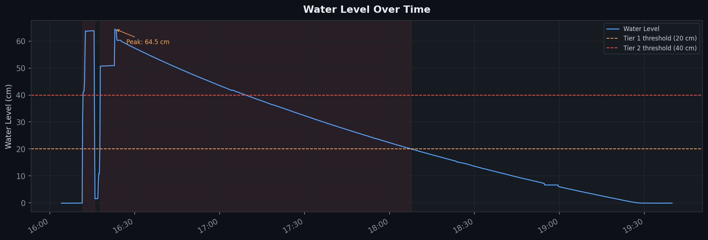
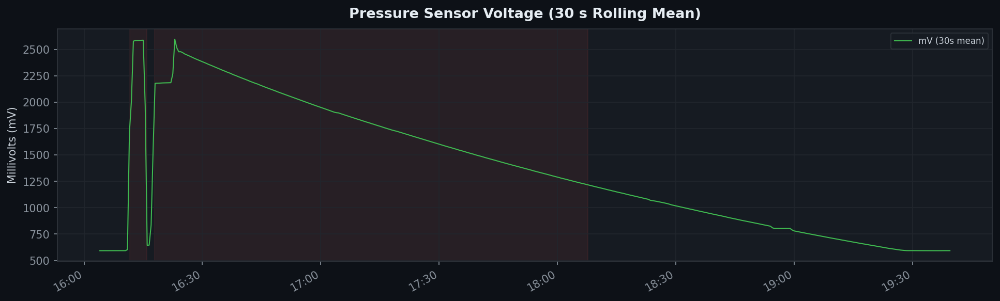
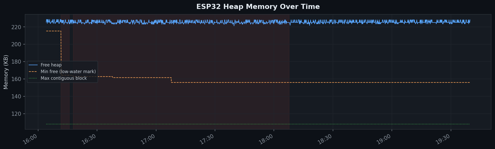
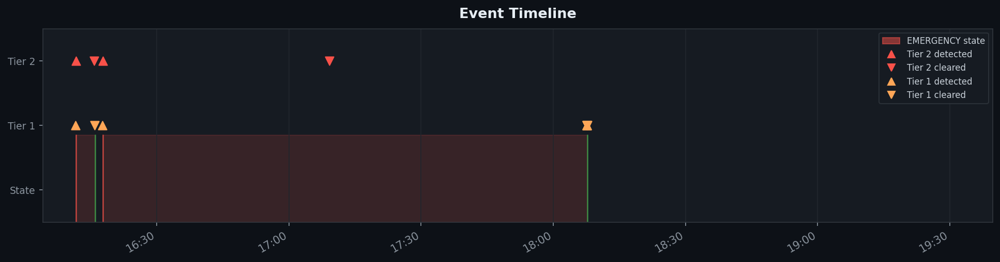

# Drip Test Analysis — 2026-05-02

**Test:** Testing cylinder filled to capacity, then allowed to drain slowly while the ESP32 streamed sensor data over MQTT to a Raspberry Pi on the LAN.
**Log:** `mqtt_log.txt` | **Duration:** 3 h 35 m (16:04 – 19:39)

---

## Summary

| Metric | Value |
|---|---|
| Peak water level | **64.48 cm** at 16:23 |
| Tier 1 threshold crossings | 5 (20 cm) |
| Tier 2 threshold crossings | 2 (40 cm) |
| ADC readings captured | 86,252 |
| Avg free heap | 225.6 KB |
| Min free heap (low-water mark) | 156.0 KB |

---

## Water Level

The cylinder was filled rapidly in the first ~7 minutes, triggering Tier 1 at 16:11:34 and Tier 2 at 16:11:38. The level briefly cleared (16:15:57), then immediately re-triggered as the second fill peaked around 64 cm before beginning the long slow drain. The system remained in `EMERGENCY` state from ~16:17 until ~18:07 as the cylinder drained across both thresholds.

---

## Pressure Sensor Voltage

Raw ADC was sampled at ~12 Hz and averaged to 30 s bins below. The voltage signal cleanly tracks the fill/drain profile with minimal noise. The small step visible around 16:15 corresponds to the first drain + refill cycle.

---

## Heap Memory

Free heap fluctuated between ~215 KB and ~238 KB throughout the run with no observable downward trend — no memory leak detected. The minimum free mark (156 KB) is a legacy low-water from earlier in the session rather than from the steady-state run.

---

## Event Timeline

Red shading shows the two `EMERGENCY` state windows. Tier 2 events (red triangles) and Tier 1 events (orange triangles) are plotted against wall-clock time.

---

## Notes

- The ~2 min window around 18:07 shows rapid Tier 1 oscillation (3 detected / 3 cleared in ~2 s) as the level hovered exactly on the 20 cm boundary during drain. May warrant a small hysteresis band.
- Total of 1,440 horn ON/OFF cycles fired during the emergency window — consistent with the defined alert cadence.
- No sensor errors or WiFi drops were logged for the entire 3.5 h run.
